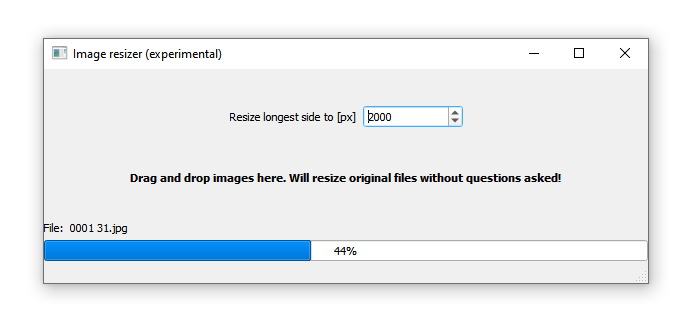

# image_resizer
Fast image resizer, written with Python in 15 minutes.

It does what it says. Just drag and drop files on the program, which will resize them. No questions asked. **Use at your own risk!**

Helpful in resizing large volumes of files with a simple, human-friendly interface.

.
